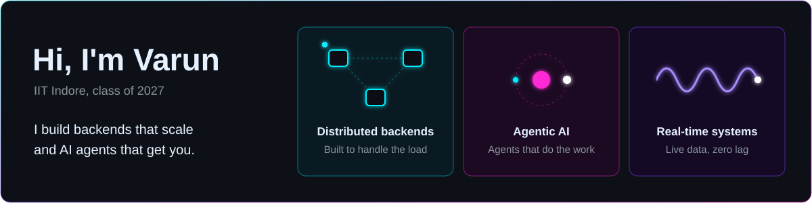
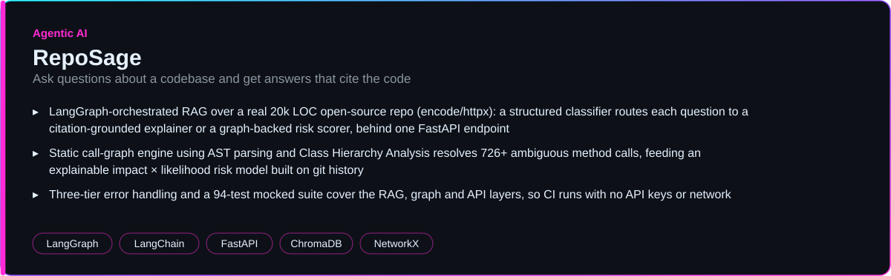
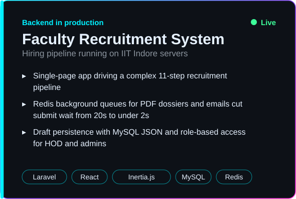
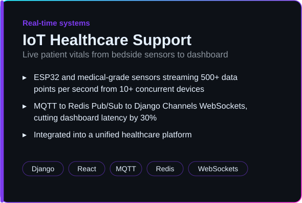

  

  

  
  
  
  
  

## About me

## Featured projects

  

  
  

## Tech stack

**Backend and distributed systems**

  
   
  
   
  
  
  

**Agentic AI**

  
  
  
  
  
  

**Databases**

**Frontend**

**DevOps and deployment**

  
   
  
  

**ML (working knowledge)**

## GitHub activity

  

  

  <picture>
    <source media="(prefers-color-scheme: dark)" srcset="https://raw.githubusercontent.com/varunbalaji167/varunbalaji167/output/github-snake-dark.svg" />
    <source media="(prefers-color-scheme: light)" srcset="https://raw.githubusercontent.com/varunbalaji167/varunbalaji167/output/github-snake.svg" />
    
  </picture>

